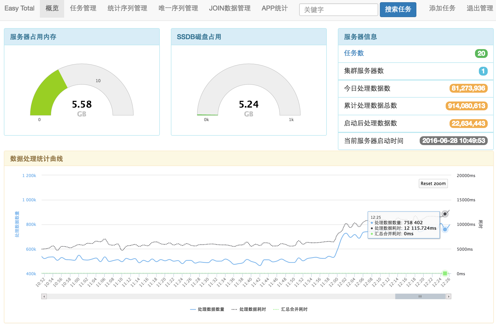
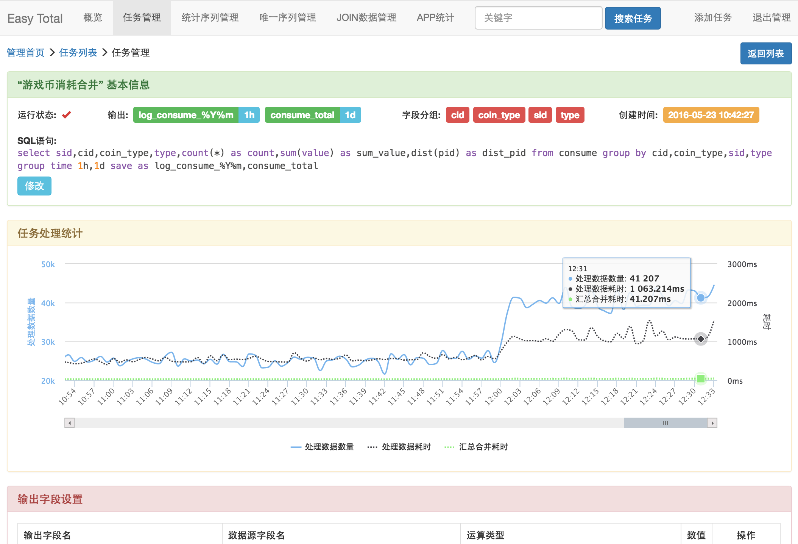

# Easy Total

这是一个通过监听预先添加好的SQL统计查询语句，对汇入的数据进行实时统计处理后不间断的将统计结果导出的服务解决方案，它解决了日志数据量非常巨大的情况下，数据库无法承载巨大的插入和查询请求的问题，并且可以满足业务统计的需求。程序的网络层是采用c写的swoole扩展进行处理，具有极高的性能，网络处理能力和 nginx 相当，处理数据模块采用 php 开发则可以方便团队根据自己的需求进行二次开发。此服务在我们线上测试环境（32核64G内存，监听了20多条SQL语句）单机每分钟可持续处理高达1000万+的日志量，峰值可达1300万+。

支持常用的运算统计功能，比如 `count`, `sum`, `max`, `min`, `avg`, `first`, `last`, `dist`，支持 `group by`、`where` 等，后续将会增加 `join` 的功能。

**特点：**

* 实时处理，定时汇出统计结果；
* 对巨大的日志量进行清洗汇总成1条或多条输出，可以成万倍的缩小数据体量，可在汇总结果中进行二次统计；
* 特别适用于对大量log的汇入统计，免去了先入库再统计这种传统方式对系统造成的负担；
* 分布式水平扩展，支持随时增删统计服务器；
* 不需要特别的技术、使用简单；
* 可以二次开发；

### 使用场景

当需要对业务数据进行统计分析时，传统的做法是把数据或日志导入到数据库后进行统计，但是随着数据量的增长，数据库压力越来越大甚至插入数据都成问题更不用说是进行数据统计了，此时只能对数据进行分库、分片等处理或者是用 hadoop、spark 等离线统计，然后就需要分布式架构，这在技术角度上来说是可行的做法，但这带来的问题就是：

1. 需要很多服务器，增加巨额托管费用；
2. 需要能够hold住这些服务器和技术的高级开发及运维人员；
3. 架构调整导致的研发难度和周期增加；

EasyTotal 正是为了解决这些问题而诞生，可以用极少的服务器以及简单的技术就能处理巨大的数据并满足业务统计的需求，对你来说一切都是那么的easy。

### 例子

SQL:
```sql
select 
  count(*), 
  sum(value) as sum_value, 
  first(time) as begin_time, 
  last(time) as last_time, 
  dist(ip) 
from test 
where status = 1 
group by type 
group time 1h, 1d 
save as total_test_limit_hour, total_test_limit_day
```

它表示将数据按每小时、每天汇总，并且按 `type` 字段分组，运算后将每小时的数据存入到 `total_test_limit_hour` 中，每天的数据存到 `total_test_limit_day` 中，字段说明如下：

字段         | 说明
------------|---------------
count       | 条数
sum_value   | 相加的value值
begin_time  | 第一条的时间值
last_time   | 最后一条的时间值
ip          | 唯一IP数


## 快速使用


### 依赖

程序需要 php 环境并安装 swoole、redis、msgpack 等php扩展，推荐 php7+, swoole 1.8.0+。需要安装并配置 redis 或 [ssdb](http://ssdb.io/) 服务器用于存储运算中的数据。

数据的汇入汇出使用 [Fluentd](http://fluentd.org/) 处理，推荐使用 Fluentd 来收集和分发日志，相比 flume 它没有 java 的那一套复杂的东西。

### CentOS 里安装方法

php推荐使用 REMI 源，[http://mirror.innosol.asia/remi/](http://mirror.innosol.asia/remi/)，

CentOS 7 安装：
```
yum install http://mirror.innosol.asia/remi/enterprise/remi-release-7.rpm
```
CentOS 6 安装：
```
yum install http://mirror.innosol.asia/remi/enterprise/remi-release-6.rpm
```

安装成功后，修改 `vim /etc/yum.repos.d/remi-php70.repo` 文件，将
`[remi-php70]`标签下的 `enabled=0` 改成 `enabled=1`，这样就默认用php7了。

然后执行
```bash
yum install php php-swoole php-redis php-msgpack
```
即可安装上 php 了。


### 加入连接

```
ln -s ./easy-total /usr/local/bin/easy-total
cp ./server.ini /etc/easy-total.conf
```

### 更改配置

请查看 server.ini 中有详细说明，其中 [server] 为服务器信息设置，运算中的临时数据将会存到 [redis] 配置的服务里，建议不要和其它服务混用

### 启动服务

直接运行 `easy-total` 即可，参数

参数     |  说明
--------|---------------
-c path | 配置文件路径，默认 /etc/easy-total.conf
-l path | 日志路径
-d      | 守护进程化方式启动
--debug | 开启debug


### 使用


#### EasyTotal Admin

页面管理工具端口同API端口，默认 8000，例如 [http://127.0.0.1:8000/admin/](http://127.0.0.1:8000/admin/)




---------------



#### API列表

API为HTTP协议，端口默认 8000，可在配置[manager]部分修改，例如 http://127.0.0.1:8000/api/task/list

* `api/task/add`          添加一个SQL任务
* `api/taak/remove`       移除一个SQL任务
* `api/task/list`         查看所有任务SQL列表
* `api/task/pause`        暂停一个任务（暂未实现）
* `api/task/start`        启用一个任务（暂未实现）
* `api/server/stats`      服务状态
* `api/server/reload`     重新加载服务器子进程（注意：如果修改配置这样重启是没有用的，需要完全退出进程后重* 启服务）
* `api/data`              获取一个实时的统计数据

#### 监听一个SQL处理语句

```
curl -d 'sql=select *,count(id) as count,dist(id) from test group by type' 127.0.0.1:8000/api/task/add
```
将会返回类似json，其中 queryKey 表示当前注册的新的sql的key

```json
{
    "status": "ok",
    "key": "31fa9231535a10ab",
    "saveAs": "test_consume",
    "sql": "select cid,count(*) as total,sum(value) as sum_value,last(time) as last_time from consume group by cid group time 1h save as test_consume"
}
```

其中 sql 是经过系统格式化后的新的SQL语句，未知的参数将会被过滤掉。


#### 移除一个SQL处理语句

```
curl -d 'sql=select *,count(id) as count,dist(id) from test group by type' 127.0.0.1:8000/api/task/remove
```


#### 查看监听的SQL列表

```
curl 127.0.0.1:8000/api/task/list
```

#### 获取实时统计的数据

分组时间超过10分钟的数据每10分钟才会导出一次数据, 如果业务有需求当前实时的统计数据, 可以通过这个接口获取到系统内实时的统计数据值

参数

* key   - 当前查询语句的key，**必须**，例如 `31fd9efbae1b4dc9`
* app   - 需要查询的app，不传则默认 `default`
* type  - 分组类型，如果一个查询中有多个则需要提供（比如 `1d`）否则默认取第一个
* group - 分组的字段值，用,分开，如果一个查询中有 `group by`关键字，则系统提供相应的分组值才能查询到数据

例：

`http://127.0.0.1:8000/api/total?key=31fd9efbae1b4dc9&app=abc&type=1h`

返回

```json
{
    "status": "ok",
    "data": {
        "_id": 2016071318,
        "_group": 2016071318,
        "count": 4,
        "sum_value": 44,
        "dist_id": 2
    }
}
```
成功则 status = ok, 失败则 status = error。

需要注意的是，如果系统内没有获取到近期的数据，则会返回
```json
{
    "status": "ok",
    "data": null
}
```


## SQL支持的语法

语法关键字（按顺序）:

* select
* from
* for
* join on 暂不支持但在计划开发功能之列 
* where
* group by
* group time
* save as

例：
`select field1,field2 as test from test where type=1 and (statu = 2 or statu = 3) and tid in (1,3,5,7,9) group by type group time 3m save as newtable` 

其中，select 和 from 为必须出现的关键字，其它为可选关键字，`group time` 不设置则默认为 1m，`save as` 不设置则默认和 `from` 相同

### select 
**select** 部分支持 `*|count|sum|max|min|avg|first|last|dist|exclude|listcount|list` 等方法，除*外其它都支持as

说明

* count - 不管是 count(field1) 还是 count(field2) 都是一样的值，差别是 count(field1) 相当于 count(\*) as field1, count(field1) 相当于 count(\*) as field2
* dist - dist(id) 会直接得到id序列的唯一count数
* exclude - 排除某个字段，比如 select *,exclued(f1),exclude(f2) 将会排除f1和f2两个字段，其它都保留
* list, listcount - 将数据全部放在列表里、对应count数，暂未实现


### from

**from** 只支持单表

### for

**for** 是用来指定项目匹配的，不设置则默认全部。比如 `select *,count(count) from test for app1,app2` 时，当log的tag是 `app1.test` 则会解析，而如果是 `app3.test` 则会忽略。

这边需要强调的是， `app1.test` 和 `app2.test` 都符合条件，但是他们的运算数据都是独立的，不会相互干扰的，默认情况下， `app1.test` 将会输出到 `merged.app1.test`，`app2.test` 将会输出到 `merged.app2.test`。

### where

和mysql语句相同，支持复合条件，比如 `where a=1 and (b=2 or b=3) and (d=1 or (e=2 and e = 3))`

支持 in 条件，比如：`where id = 3 and type in (2,4,6)`

支持 not in 条件，比如：`where id = 3 and type not in (2,4,6)`

支持个别方法，比如：

* `a % 10 = 1`
* `a >> 10 = 1`
* `a << 10 = 1`
* `a / b = 1`
* `a - b = 1`
* `a * b = 1`
* `a + b = 1`
* `from_unixtime(a, '%Y-%m-%D %H:%i:%s') = 2016-10-10 10:10:01`
* `unix_timestamp(a) >= 1234567890`

匹配符支持：

* `>`
* `<`
* `!=` 或 `<>`
* `>=`
* `<=`

### group by 

根据字段分组，例如 `group by a,b` 表示按a和b两个字段同时进行分组

### group time

这个是一个 *特有* 的关键词，不设置则默认是 `group time 1M`（1分钟）。它的用途是按时间戳将数据分组，在1组里数据将会和另外一组的数据隔离，也就意味着你去算dist，sum等时，是分开来的，输出导出时也是分开的。

支持1条SQL多个分组序列，例如 `grouu time 1d,1h,10M` 表示数据将分别按1天，1小时，10分钟分成3组分别输出3份序列，但是需要注意的是，每个序列都是独立的，分组序列越多也就意味这系统需要暂存的数据就会越大。

可选参数：

参数     | 简写    | 示例    | 说明
--------|---------|--------|---------
year    | y       | 1y     | 按年分组，每10分钟输出1次
month   | m       | 1month | 按月分组（注意是小写的m），每10分钟输出1次
week    | w       | 1w     | 按周分组，每10分钟输出1次
day     | d       | 1day   | 按天分组，每10分钟输出1次
hour    | h       | 2h     | 按小时分组，每10分钟输出1次
minutes | M 或 i  | 1M     | 按分钟分组（注意是大写的M），若是 <= 10M 则每分钟输出1次，>10M 则每10分钟输出1次
seconds | s       | 30s    | 按秒分组，每分钟输出1次
none    |         | none   | 强制不按时间分组，此时建议按 group by 主键字段分组可得到去重后的数据，请不要使用在不断增长且需要统计的序列上，否则缓存的序列将会同步增长且无法被系统自动清理，每1分钟输出1次


*使用例子：*

假设sql语句是 `select *, count(*), dist(title) as dist_title, first(id) as first_id from test`，下面有几条数据

id   |  title  | time （time应该是时间戳，但为便于识别所以写成了以下日期的格式）
-----|---------|-------------------------------
1    | a       | 2016-05-01 20:20:10
2    | a       | 2016-05-01 20:20:20
3    | a       | 2016-05-01 20:21:10
4    | a       | 2016-05-01 20:21:20
5    | b       | 2016-05-01 20:21:30

那么如果 group time 1M (默认) 的话则会产生2条数据分别是

_id          |_group   | id   |  title  | time                 | count | dist_title | first_id
-------------|---------|------|---------|----------------------|-------|------------|------------
1i_1234567   | 1234567 | 2    | b       | 2016-05-01 20:20:20  | 2     | 1          | 1
1i_1234568   | 1234568 | 5    | e       | 2016-05-01 20:21:30  | 3     | 2          | 3

那么如果 group time 1d (1天) 即 `select *, count(*), dist(title) as dist_title, first(id) as first_id from test group time 1d save as test_per_1d` ，则会产生1条数据：

_id          |_group   | id   |  title  | time                 | count | dist_title | first_id
-------------|---------|------|---------|----------------------|-------|------------|------------
1d_1234567   |1234567  | 5    | e       | 2016-05-01 20:21:30  | 5     | 2          | 1

（ps: 以上 `_id`，`_group` 是系统生成的，1d_1234567 只是一个列子，并不表示一定是它）
鉴于实际的统计需要，可以对同一个数据重复添加相应的sql监听需求以满足业务需求。

另外需要注意的是，系统是实时统计进行迭代更新的，所以如果按1day分组的话，系统会在每分钟（默认设置，可在配置中修改）导出更新一次数据，所以需要确保 _id 字段为主键或唯一索引。


### save as

将统计出的数据保存到一个新的关键字序列，默认不写则和来源一样。例如: `select count(*) from test save as newtable` 。

支持时间通配符，例如 `save as test_%Y_%m` 表示数据将按 `test_2016_02`, `test_2016_03` 这样分别导出存储，方便分表分库。

通配符参数前缀都是 `%` 开始，常用时间参数如下（注意大小写）：

* %Y - 年
* %m - 月
* %d - 日
* %H - 时
* %i - 分
* %s - 秒
* %W - 周

更多参数请见 [http://php.net/manual/zh/function.date.php](http://php.net/manual/zh/function.date.php)

**多时间序列分别导出**，例如： `select * from test group time 1d,1h save as test_day_%Y%m, test_hour_%Y%m%d` 有2个时间序列统计则会分别导出到 `test_day_201604` 和 `test_hour_20160406` 里。

**前缀设置**：在配置里的 [output] 中可以设置 tag_prefix 输出前缀，例如 `tag_prefix = merged.`，如果请求的tag是
`log.app1.test` 则会输出到 `merged.app1.test`


## 数据输入输出TCP协议
完全兼容 Fluentd 协议，并同时支持 json、msgpack方式，see [http://docs.fluentd.org/articles/in_forward](http://docs.fluentd.org/articles/in_forward)

每个数据库包的大小请不要超过6MB

### 单条数据格式：
`[tag, time, record, option]`

例如: 
```json
["myapp.test",1234567890,{"id":1,"hello":"world"},{"chunk":"abcdef"}]
```

其中 abcdef 为随机字符串，服务器收到消息并处理则会返回如下ACK确认内容：
```json
{"ack":"abcdef"}
```
如果超过180秒没有返回则可视为处理超时，重新提交。其中 1234567890 为当前数据对应的时间戳，若数据中含有 time 字段则以此字段优先。


### 多条格式(推荐，处理效率高)：

`[tag, [[time,record], [time,record], ...], option]`

例如：
```json
["myapp.test",[[1234567890,{"id":1,"hello":"world"}],[1234567891,{"id":2,"hello":"world2"}]],{"chunk":"abc"}]
```

处理成功后返回ack确认同单条模式。

处理后输出格式同TCP协议，可以用 Fluentd 接受数据。

另外，不管是单条还是多条模式， option参数都是可选的，不传则服务器不会有任何返回，这个可以在测试期间使用，但是因为没有ACK确认，所以你无法知道服务器到底是否处理成功，所以生产环境务必加入ACK确认。


## 使用注意

EasyTotal是为大日志处理量身打造的实时处理服务器，如果你使用 ssdb 做储存数据请务必落盘在ssd硬盘上，如果落在机械硬盘上在处理数据达到一定级别后会导致 ssdb 服务吃满硬盘的IO，导致服务器异常的慢，如果你用的是redis，也请注意保留适当时间的缓存数据或者设定好redis内存限制，否则会导致redis吃满内存。

配置中 worker_num 是用来处理前端数据的进程数，一般10个左右就可以了，如果连接来源比较多，可以调大，task_worker_num 是用来输出推送的进程数据，根据实际运行的任务数进行调节，20-60个就差不多了（或CPU数的1-3倍），如果任务数特别多，可以调大或分服务器运行。

## 使用建议

* 数据库索引通常是推荐对那些数据散列比较多的字段进行索引，比如a字段可能会有上万种记录，b字段可能只有10种记录，对于数据库来说a字段更适合做索引，b字段则不适合做索引；但在 EasyTotal 里更适合对 b 字段进行 group by 统计，因为那样产生的序列会相对较少；
 
* EasyTotal 擅长做的是把相同组别的数据进行合并后输出，这样就可以大幅缩减你的数据量，然后你就可以在这些数据上做二次查询统计。<br>比如你有一个用户的行为操作日志数据，每个用户会产生大量的重复的数据，但是业务统计时可能大多是统计某个时段（比如1天、1小时）的唯一用户数、用户操作的次数、产生数据的总和等等，这样，你就可以用 EasyTotal 对用户id进行分组不断的导出每个用户的行为数据，这样数据的总量是 <= 用户总数的，然后你的程序可以在这些导出的数据上进行查询统计。


## License

Apache License Version 2.0 see http://www.apache.org/licenses/LICENSE-2.0.html